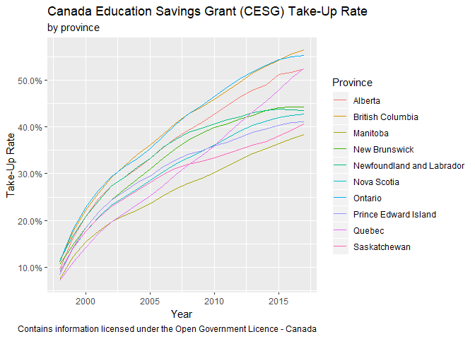

CESG Take-Up Rate
================
Liam Tarr

What is the CESG?
-----------------

The Canada Education Savings Grant (CESG) is money that the Government adds to a Registered Education Savings Plan. This money helps to pay the costs of a child's full- or part-time studies after high school at:

-   apprenticeship programs
-   CEGEPs
-   trade schools
-   colleges
-   universities

The lifetime maximum amount of CESG a child can get is $7,200.

See more at [this Canadian government website](https://www.canada.ca/en/employment-social-development/services/education/grants/savings.html)

CESG Take-Up Rate
-----------------

Let's explore the CESG take-up rate.

``` r
library(tidyverse)
library(lubridate)
```

Let's read in our data and check it out.

``` r
cesg <- read_csv("CESG4.csv", skip = 2)
head(cesg)
```

    ## # A tibble: 6 x 21
    ##   `Province/Terri~ `1998` `1999` `2000` `2001` `2002` `2003` `2004` `2005`
    ##   <chr>            <chr>  <chr>  <chr>  <chr>  <chr>  <chr>  <chr>  <chr> 
    ## 1 Alberta          9.50%  16.30% 20.90% 24.60% 27.30% 29.10% 31.10% 33.20%
    ## 2 British Columbia 11.00% 17.70% 22.20% 25.80% 29.20% 31.60% 34.10% 36.10%
    ## 3 Manitoba         7.50%  12.20% 15.50% 17.70% 19.70% 21.00% 22.30% 23.60%
    ## 4 New Brunswick    10.60% 14.90% 18.50% 21.70% 24.40% 26.60% 28.80% 31.00%
    ## 5 Newfoundland an~ 11.50% 16.80% 20.80% 24.20% 27.30% 29.20% 31.40% 33.30%
    ## 6 Nova Scotia      9.10%  14.10% 17.70% 20.70% 23.30% 25.00% 26.80% 28.50%
    ## # ... with 12 more variables: `2006` <chr>, `2007` <chr>, `2008` <chr>,
    ## #   `2009` <chr>, `2010` <chr>, `2011` <chr>, `2012` <chr>, `2013` <chr>,
    ## #   `2014` <chr>, `2015` <chr>, `2016` <chr>, `2017` <chr>

Obviously, this data is not tidy. This is because the column names are values. This goes against the tidy mindset. Let's clean it up using `gather` from `tidyr`.

``` r
cesg %>%
  gather(key = "year", value = "participation", -`Province/Territory`) %>%
  rename(Province = `Province/Territory`) -> cesg

head(cesg)
```

    ## # A tibble: 6 x 3
    ##   Province                  year  participation
    ##   <chr>                     <chr> <chr>        
    ## 1 Alberta                   1998  9.50%        
    ## 2 British Columbia          1998  11.00%       
    ## 3 Manitoba                  1998  7.50%        
    ## 4 New Brunswick             1998  10.60%       
    ## 5 Newfoundland and Labrador 1998  11.50%       
    ## 6 Nova Scotia               1998  9.10%

This is much better. Now the years are in a new column named `year`.

To make it even better, let's make the `year` strings `Date` objects using `lubridate`.

Let's also take that pesky % mark out of the values, so we can make those numeric easily.

``` r
cesg <- cesg %>%
  mutate(year = as.Date(paste(year, "01", "01", sep = "-")))

cesg %>%
  mutate(participation = as.numeric(substr(participation, 1, nchar(participation) - 1)) / 100) -> cesg
```

Let's make things nicer for the computer by cleaning up Quebec's name. There is probably a better way to handle it, but this is my solution.

``` r
to_replace <- grep("^Q", cesg$Province)

cesg$Province[to_replace] = "Quebec"
```

Plotting the Data.
------------------

To make the plot clearer, I'm going to remove the territories. Sorry guys!

``` r
cesg <- cesg %>%
  filter(!Province %in% c("Northwest Territories", "Yukon", "Nunavut") )
```

This first plot shows the take-up rate of the CESG over time, by province.



This second plot shows the same thing, but highlights the average for all of Canada.


